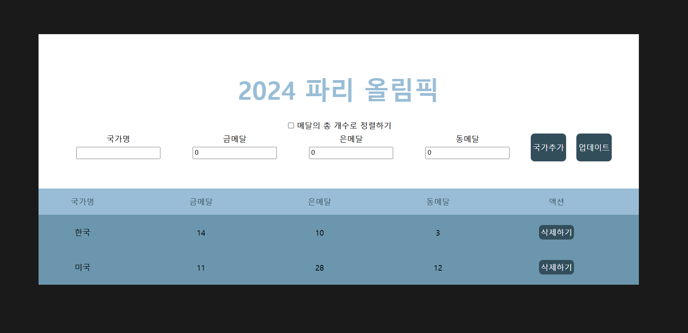

# React + Vite

리액트롸 바이트를 이용한 올림픽 정리 웹페이지 만들기

---------------------

- 수행한 기능

-- 필수

기본 기능에서는 컴포넌트 분리 외에 모든 기능을 수행하였다.

-- 도전

중복 국가 처리, 존재하지 않는 국가 알림, 총 메달 수 정렬을 완료하였다.
로컬 스토리지 활용은 컴포넌트 분리에 집중하다 수행하지 못했다.

---------------------

- 배운점

-- input

label로 input을 묶는게 깔끔하다는 것을 배웠다. 묶지 않고 진행했을때 css에 신경써야하는 시간이 늘어남을 알았다.
input에 type을 지정하여 체크박스, 버튼 등 다양한 표현이 가능함을 알았다.
input에 min 값을 주어 숫자의 최소 값을 지정해 양수만 받아올 수 있다는 것을 알았다.
input값을 숫자로 지정할 때, +e.target.value 하면 앞의 플러스가 숫자로 지정해준다.

-- form

submit은 form과 연결하여 사용할 수 있고, submit이 타입인 버튼이나 인풋은 하나만 존재해야 개별 동작이 가능함을 배웠다.
또한 form을 사용한 경우가 아닌 경우 직접 작성한 css보다 훨씬 깔끔하고 좋았다.

--useEffect, useState

여전히 어렵지만 직접 사용해봄으로서 조금 배운 기분이 든다. 앞으로 사용에 도움이 될 것 같다. 

--배열메소드

sort의 다양한 방법을 배웠다. filter와 map의 사용으로 숙련도를 늘린 느낌이다.

-----------------------

- 검토사항

--컴포넌트

여전히 컴포넌트를 분리해서 작성하는 것이 어렵다.
처음부터 분리해서 작성을 하는 것이 옳을지, 모든 기능을 완수하고 분리하는 것이 옳은지 감이 오지 않는다.

--변수명

변수명과 함수명을 신경써달라는 피드백을 받았다. 노력했으나 제대로 수행되었는지는 검토가 필요할 것 같다.

--커밋방식

커밋..을 예쁘게 해달라하셨는데 지키지 못했다.. 티타임을 가질 것 같다..

--props

사용을 하지 않았다. 공부가 필요하다.

---------------------

아래는 바이트의 기본 readme이다
This template provides a minimal setup to get React working in Vite with HMR and some ESLint rules.
Currently, two official plugins are available:
- [@vitejs/plugin-react](https://github.com/vitejs/vite-plugin-react/blob/main/packages/plugin-react/README.md) uses [Babel](https://babeljs.io/) for Fast Refresh
- [@vitejs/plugin-react-swc](https://github.com/vitejs/vite-plugin-react-swc) uses [SWC](https://swc.rs/) for Fast Refresh
